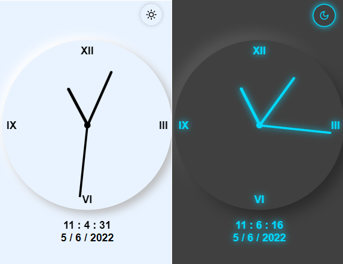

# Analog clock using HTML(<>) , Css (:) and JS (=>).

## demo link ([here](https://dark-night86.github.io/Js-Analog-clock/))

## Preview Image :


## JavaScript code for analog clock =>

```Js

setInterval(() => {
    let time = new Date();
    
    let h = time.getHours();
    let m = time.getMinutes();
    let s = time.getSeconds();

    let h_rotate = h * 30 + m / 2;
    let m_rotate = m * 6;
    let s_rotate = s * 6; 

    hour.style.transform = "rotateZ(" + h_rotate + "deg)";
    minute.style.transform = "rotateZ(" + m_rotate + "deg)";
    second.style.transform = "rotateZ(" + s_rotate + "deg)";

}, 1);
```
## JavaScript code for Digital clock and Date =>

```Js
setInterval(() => {
    let time = new Date();
    //! date ===> 
    date.innerHTML = time.getDay() + " / " + time.getMonth() + " / " + time.getFullYear();
    
    //! digital_clock ===> 
    digital.innerHTML = time.getHours() + " : " + time.getMinutes() + " : " + time.getSeconds();
}, 1);
```

## main colors are from *Samuel George* ( to see the project click [here](https://github.com/Samuel796George/clock))


- notify me if you found a bug , so I'm gonna fix it ,
- Contact me from my E-mail adress in my profile ,
- If you had any Idea please tell me .
